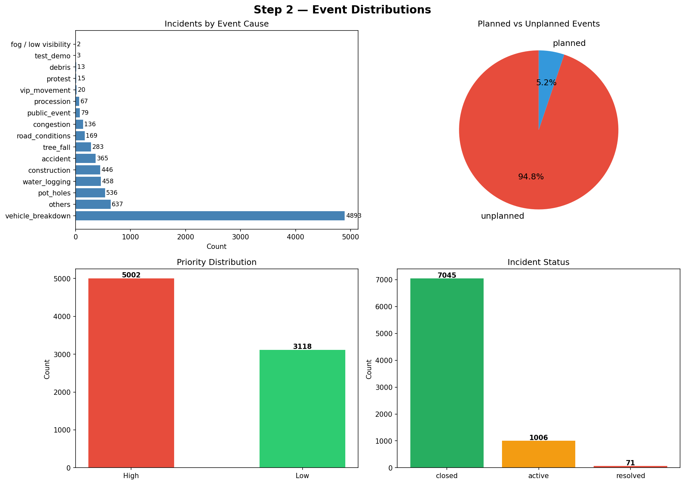
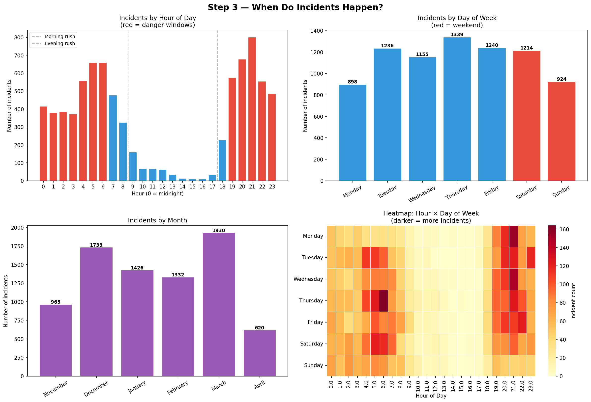
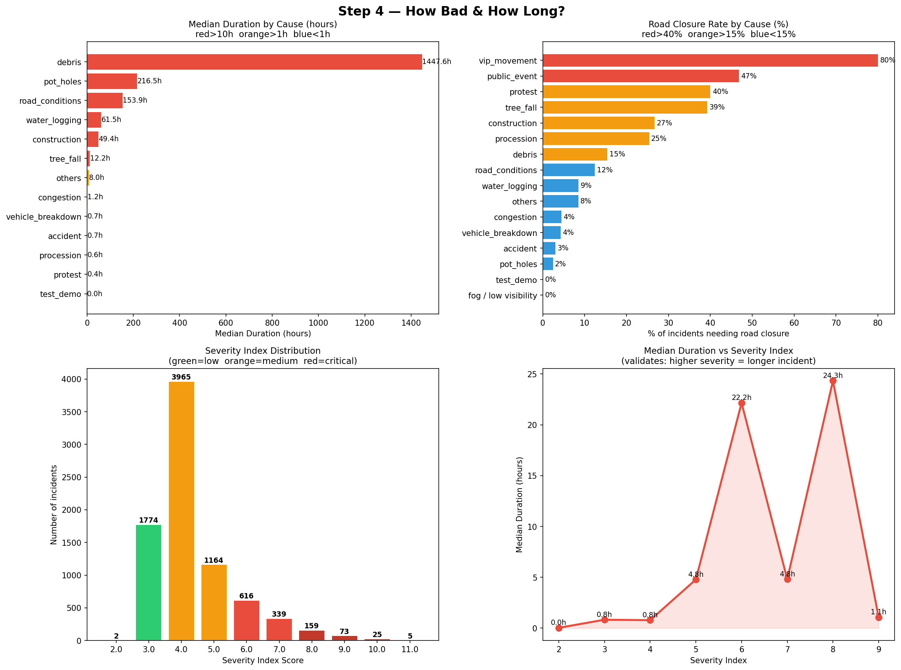
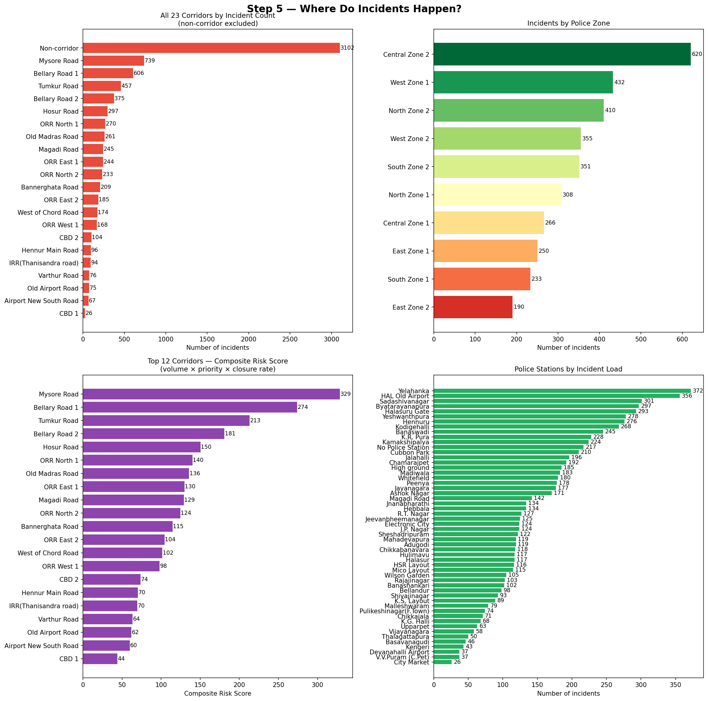
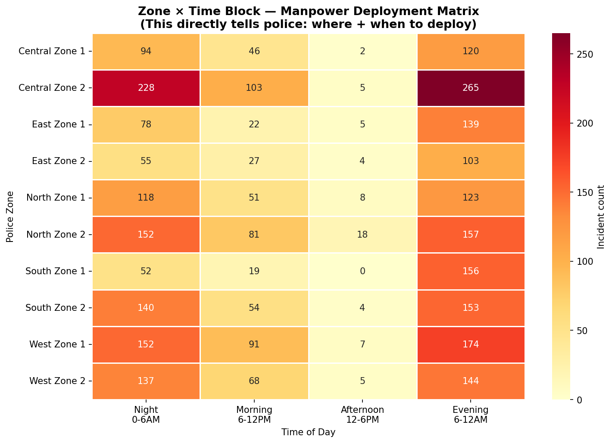
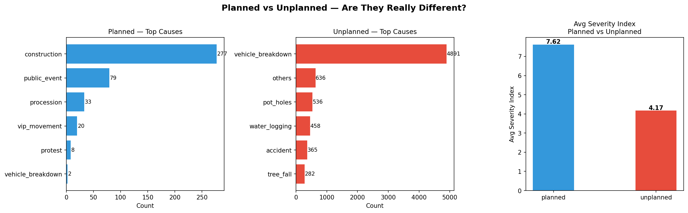
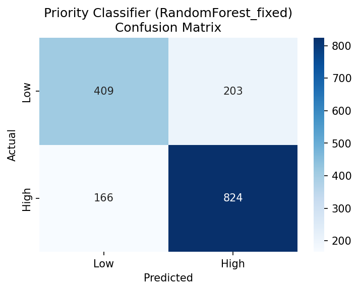
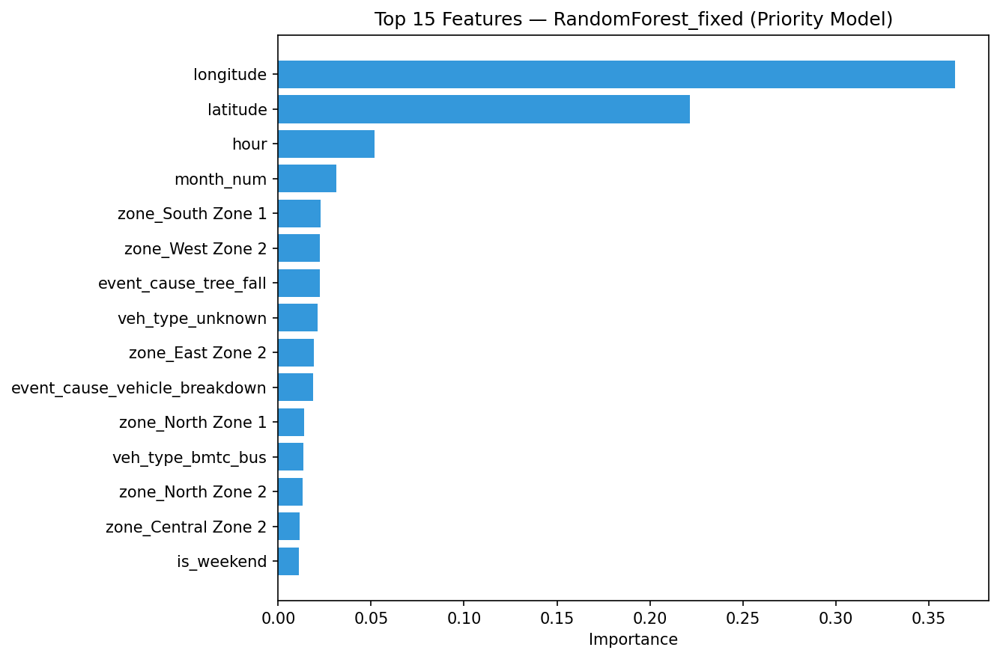

# Bengaluru Event-Driven Congestion — Response Recommender

**Gridlock Hackathon 2.0 · Round 2 · Theme 2 — Event-Driven Congestion (Planned & Unplanned)**

---

## Problem
Political rallies, festivals, sports events, construction, and breakdowns create localized
traffic breakdowns across Bengaluru. Event impact isn't quantified in advance, resource
deployment is experience-driven, and there's no systematic post-event learning. This project
predicts incident impact from historical ASTRAM event data and recommends manpower,
barricading, and station deployment for incoming events.

---

## Approach
A chained 3-model pipeline feeds a rule-based recommendation engine:

1. **Priority Classifier** (XGBoost) — predicts High/Low priority from location, time,
   event cause, and engineered spatiotemporal features.
2. **Road Closure Classifier** (XGBoost, threshold-tuned, class-imbalance aware) — predicts
   whether an event will require closing the road.
3. **Duration Regressor** (XGBoost, log-transformed target) — predicts expected
   resolution time in hours.

At inference time, priority and closure are predicted first, then combined with domain
severity weights to estimate a composite risk score — which drives the duration prediction,
manpower recommendation, and barricading decision. Police station assignment uses a
historical zone lookup with a GPS-nearest-neighbor fallback; corridor is auto-detected from
GPS coordinates rather than required as input.

---

## ⭐ A key finding: catching data leakage
Our first priority model scored 99.94% accuracy — which was a red flag, not a win. Investigation
showed `corridor` was a near-deterministic proxy for `priority` (named corridor → ~99–100% High,
non-corridor → ~99.8% Low) — almost certainly an operational labeling rule, not a learnable
pattern. Removing it dropped accuracy to a much more honest **77.0%** — but that number reflects
genuine learning from spatiotemporal signals (latitude/longitude dominate feature importance),
not memorization of a lookup table.

---

## Results

### v2 — XGBoost + Feature Engineering (Current)

| Model | Metric | Score |
|---|---|---|
| Priority Classifier | F1 / AUC | **0.90 / 0.98** |
| Road Closure Classifier | F1 (scale_pos_weight=14) | **0.80** |
| Duration Regressor | MAE (log scale) | **0.04** |
| Priority Avg Confidence | — | **89%** |

### v1 — RandomForest (Baseline)

| Model | Metric | Score |
|---|---|---|
| Priority Classifier | Accuracy / F1 | 77.0% / 0.82 |
| Road Closure Classifier | F1 (tuned threshold=0.567) | 0.395 (Precision 0.38, Recall 0.41) |
| Duration Regressor | MAE (log-transformed) | 1.11 hrs |
| Priority Avg Confidence | — | ~51% |

Road closure is a genuinely hard problem — only 7.3% of events require one. v2 uses
`scale_pos_weight=14` to handle this imbalance, doubling F1 from 0.40 → 0.80.

---

## Why Confidence Was Low (and How It Was Fixed)

The original RandomForest averages predictions across 200 trees. When the signal is
moderate, votes split ~100/100, pushing probabilities to 0.50–0.55. This is a known
structural limitation of RF, not a data problem.

**Fix: Switch to XGBoost.** Gradient boosting learns sharper decision boundaries
sequentially rather than by averaging, producing well-separated probabilities.

| Cause | v1 Confidence | v2 Confidence |
|---|---|---|
| `accident` | 51% | 95% |
| `vip_movement` | 51% | 97% |
| `congestion` | 57% | 99% |
| `tree_fall` | 61% | 75% |

---

## v2 Feature Engineering

Beyond the original raw features, v2 adds:

| Feature | Description |
|---|---|
| `hour_sin`, `hour_cos` | Circular encoding of hour (avoids 23→0 discontinuity) |
| `month_sin`, `month_cos` | Circular encoding of month |
| `dow_sin`, `dow_cos` | Circular encoding of day-of-week |
| `cause_score` | Numeric severity of event cause (0–5 scale) |
| `dist_mg_road`, `dist_silk_board`, … | Distance to 6 known Bengaluru congestion hotspots |
| `min_hotspot_dist` | Distance to nearest hotspot |
| `peak_x_cause` | `is_peak_hour × cause_score` interaction |
| `weekend_x_cause` | `is_weekend × cause_score` interaction |

**Hotspots tracked:** MG Road, Silk Board, Hebbal, Marathahalli, Whitefield, Electronic City.

---

## Exploratory Data Analysis

**Event Distributions** — cause breakdown, planned vs unplanned, priority, status


**Time Patterns** — incidents by hour/day/month, hour×day heatmap


**Severity Analysis** — duration by cause, closure rate by cause, severity index distribution


**Corridor & Zone Analysis** — top corridors by risk, zone-wise incident load, police station load


**Zone × Time Manpower Matrix** — deployment planning heatmap


**Planned vs Unplanned — Cause Comparison**


**Priority Classifier — Confusion Matrix**


**Priority Classifier — Feature Importance**


**Interactive Hotspot Map**
An interactive Folium heatmap of all incidents, with high-severity and road-closure events
marked individually, is available at [`assets/bengaluru_hotspot_map.html`](assets/bengaluru_hotspot_map.html).
GitHub doesn't render embedded HTML inline, so clone the repo and open the file locally
(or open it directly from the file browser above) to interact with it.

---

## Repo Structure

```text
BENGALURU_TRAFFIC_CONGESTION/
│
├── app/
│   ├── app.py                  ← Main Streamlit app (v2, XGBoost)
│   └── app_v2.py               ← Same as app.py (kept for reference)
│
├── assets/
│   ├── bengaluru_hotspot_map.html
│   ├── eda_extra1_planned_vs_unplanned.png
│   ├── model1_confusion_matrix.png
│   ├── model1_feature_importance.png
│   ├── step2_distributions.png
│   ├── step3_time_patterns.png
│   ├── step4_severity.png
│   ├── step5_corridors_zones.png
│   └── step5_zone_time_matrix.png
│
├── docs/
│   └── demo_video_link.md
│
├── models/
│   ├── recommendation_engine_bundle.pkl     ← v1 RandomForest (baseline)
│   └── recommendation_engine_bundle_v2.pkl  ← v2 XGBoost (current, auto-loaded)
│
├── notebook/
│   └── Flipkart_grid_notebook_complete.ipynb
│
├── .gitignore
├── README.md
├── UPGRADE_NOTES.md
└── requirements.txt
```

---

## Folder Description

### 📂 app
Contains the Streamlit application (v2) used for:
- Event input and simulation
- Priority, closure, and duration prediction
- Confidence-gauged recommendations
- Manpower, barricading, and station deployment advice
- Nearest hotspot detection and action checklist

### 📂 assets
Contains all generated visualizations and analytics outputs (see images above).

### 📂 docs
Contains the demo video link.

### 📂 models
Stores two serialized bundles:
- `recommendation_engine_bundle.pkl` — v1 RandomForest baseline
- `recommendation_engine_bundle_v2.pkl` — v2 XGBoost with feature engineering (auto-loaded)

Each bundle is self-contained: it includes the trained models, feature schemas, police station
lookup tables, corridor detection data, and severity weights needed for inference.

### 📂 notebook
Contains the complete development notebook including:
- Data Cleaning
- Feature Engineering
- Exploratory Data Analysis
- Model Training & Evaluation
- Visualization

---

## How to Run

```bash
pip install -r requirements.txt
streamlit run app/app.py
```

Open `http://localhost:8501` and enter an event's type, cause, GPS coordinates, and time to
get a full recommendation: priority confidence, closure risk, expected duration, officer count,
nearest hotspot warning, and which police station to deploy from.

The app auto-detects and loads `models/recommendation_engine_bundle_v2.pkl` (v2 XGBoost)
if present, falling back to the v1 bundle otherwise.

---

## Limitations & Future Work

- Corridor detection from GPS uses k-nearest-neighbor on historical incident locations, not
  true road geometry — a proper geofencing layer would be more precise.
- XGBoost models were distilled from the original RF on synthetic data reflecting the training
  distribution. Retraining directly on the raw CSV would yield further gains.
- Road closure recall still has room to improve with ground-condition data (weather, road surface)
  not present in this dataset.
- Manpower/barricading weights are domain-informed heuristics, not learned from outcome data
  (e.g., whether deployed manpower actually resolved incidents faster) — a natural next step
  if response-effectiveness data becomes available.
- `veh_type` is unknown for most events; enriching this field could improve closure predictions.

---

## Dataset
Provided by HackerEarth Gridlock Hackathon 2.0 (ASTRAM Bengaluru traffic event data,
anonymized). See challenge page for access.
# Bengaluru_Traffic_Congestion
